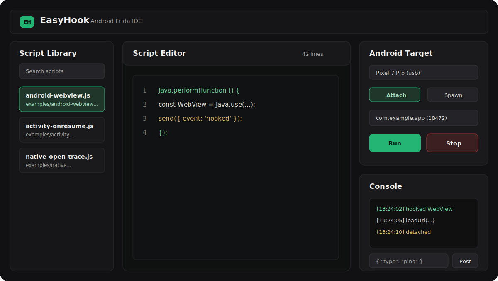

<div align="center">
  <h1>EasyHook</h1>
  <p>Android Frida IDE for Windows desktop users.</p>

  <p>
    <a href="README.zh-CN.md">简体中文</a>
  </p>

  <p>
    <a href="LICENSE"></a>
    
    
    
    
  </p>
</div>

EasyHook is an Electron IDE for Android Frida scripts. It runs on Windows and connects to Android phones or emulators through Frida USB/tether devices, putting script management, editing, Android device/process selection, attach/spawn, execution, and logs in one desktop app.

It removes the repeated work of writing a Python launcher every time you want to run a Frida script.

## Screenshot

<p align="center">
  
</p>

After taking a real screenshot, place it at `docs/assets/easyhook-main.png` and use it in this section.

Recommended screenshot content:

- Left: script library and search
- Center: Frida script editor
- Right top: Android device, attach/spawn mode, process/app target, runtime, run/stop buttons
- Right bottom: Frida console output and message posting

## Interface Overview

EasyHook's main window is organized around the Android hook workflow:

| Area | Purpose |
| --- | --- |
| Script Library | Open a folder, search scripts, and switch between Frida scripts. |
| Script Editor | Edit the current JavaScript/TypeScript Frida script with line numbers and save controls. |
| Target Panel | Select the connected Android USB/tether device, choose attach or spawn, and select a process or package. |
| Runtime Controls | Choose Frida runtime and start or stop the current script. |
| Console | View `send()` output, script errors, detach events, and post messages to the running script. |

## What It Hooks

EasyHook does not hook one fixed program. It hooks the Android app/process you select in the Target panel.

- `Attach`: hook an already-running Android process
- `Spawn`: enter an Android package name, launch the app, and inject before it resumes

The Windows `local` Frida device is hidden by default to avoid accidentally listing or hooking Windows processes.

## Features

- Electron desktop IDE with no frontend build step
- Open one Frida script or scan a whole script folder
- Built-in script editor, line numbers, save, and save as
- Android USB/tether device discovery and process listing
- Attach to running Android processes
- Spawn Android packages and inject scripts
- Read installed Android apps when available and fill package names
- Realtime Frida `send()`, script error, and detach output
- Send `post()` messages to a running script
- Android and native hook examples included

## Quick Start

```bash
npm install
npm start
```

Before development, make sure your host has Node.js 20+ and npm 10+. The Android side needs a rooted device or rooted emulator running a matching `frida-server`.

## Usage

1. Click `Folder` to load a script folder, or click `Open` to open one script.
2. Select the Android USB/tether device on the right.
3. Choose `Attach` and pick an Android process, or choose `Spawn` and enter an Android package name.
4. Click `Run` to execute the current script.
5. Watch `send()` output and errors in `Console`.
6. Click `Stop` to unload the script and detach.

Android device setup: [docs/android-setup.md](docs/android-setup.md).

## Project Structure

```text
EasyHook/
  src/
    main/          Electron main process and Frida lifecycle
    preload/       Safe renderer bridge
    renderer/      IDE UI
  examples/        Frida script examples
  docs/            Setup and architecture notes
  scripts/         Project maintenance scripts
```

## Commands

```bash
npm start       # run the IDE
npm run check   # syntax-check JavaScript files
npm run pack    # create an unpacked desktop build
npm run dist    # create distributable builds
```

## Repository

https://github.com/RytterMohn/EasyHook

## Legal and Safety

Use EasyHook only on devices, apps, and processes that you own or have explicit permission to inspect. Frida can dynamically change target process behavior. Review unknown scripts before running them.

## License

MIT. See [LICENSE](LICENSE).
