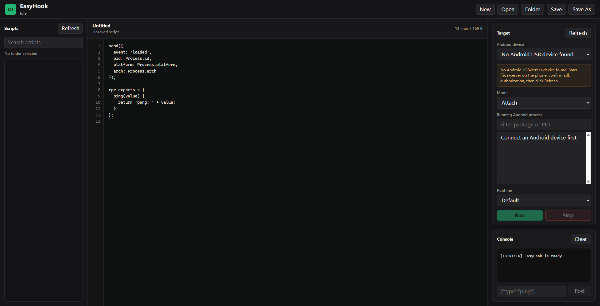

# EasyHook：一个运行在 Windows 上的 Android Frida 脚本 IDE

如果你经常写 Frida 脚本，大概率遇到过一个很烦的问题：真正想写的是 hook 逻辑，但每次运行脚本前，还要准备 Python 启动器、选择设备、attach 进程、处理日志输出。脚本多了以后，管理和运行也会变得很散。

所以我做了一个小工具：[EasyHook](https://github.com/RytterMohn/EasyHook)。

EasyHook 是一个运行在 Windows 桌面端的 Android Frida 脚本 IDE。它通过 Frida USB/tether device 连接 Android 手机或模拟器，把脚本管理、代码编辑、Android 设备选择、进程选择、attach/spawn、运行控制和日志输出整合到一个桌面应用里。


## 为什么做 EasyHook

Frida 本身非常强大，但日常使用里有几个重复动作：

- 写完脚本后，还要再写 Python 或命令行启动逻辑。
- attach 和 spawn 的参数经常要重复输入。
- 多个脚本散落在目录里，切换和管理不够顺手。
- `send()` 输出、错误栈、detach 状态需要自己组织显示方式。
- 在 Windows 上使用时，容易误选到本机 local device，看到一堆 Windows 进程，而不是 Android app。

EasyHook 的目标不是替代 Frida，而是把常见 Android hook 工作流做成一个更直接的桌面入口。

## EasyHook 主要解决什么

EasyHook 不固定 hook 某一个程序。它 hook 的目标是你在界面右侧 Target 面板里选择的 Android app/process。

目前支持两种常用方式：

- `Attach`: 选择已经运行中的 Android 进程并注入脚本。
- `Spawn`: 输入 Android 包名，启动应用后立即注入脚本。

默认情况下，EasyHook 会隐藏 Windows 本机的 Frida `local` device，优先显示 Android USB/tether 设备，避免误把 Windows 进程当作 hook 目标。

## 界面主要包括哪些内容

EasyHook 的界面围绕一条完整工作流设计：选脚本、选设备、选目标、运行、看日志。



主要区域如下：

| 区域 | 作用 |
| --- | --- |
| 脚本库 | 打开脚本目录、搜索脚本、切换 Frida 脚本。 |
| 脚本编辑器 | 编辑当前 JavaScript/TypeScript Frida 脚本，支持行号和保存。 |
| Target 面板 | 选择 Android USB/tether 设备，选择 attach 或 spawn，并选择进程或包名。 |
| 运行控制 | 选择 Frida runtime，启动或停止当前脚本。 |
| Console | 查看 `send()` 输出、脚本错误、detach 事件，并向运行中的脚本发送消息。 |

## 功能特性

EasyHook 当前已经包含这些基础能力：

- Electron 桌面 IDE，无前端构建步骤。
- 读取单个 Frida 脚本或整个脚本目录。
- 内置脚本编辑器、行号、保存和另存为。
- Android USB/tether 设备枚举和进程列表。
- 支持 attach 已运行 Android 进程。
- 支持 spawn Android 包名后注入脚本。
- 支持读取 Android installed apps 并填充包名。
- 实时显示 Frida `send()`、脚本错误和 detach 状态。
- 支持向运行中的脚本 `post()` 消息。
- 内置 Android 和 native hook 示例。

## 快速开始

先克隆仓库：

```bash
git clone https://github.com/RytterMohn/EasyHook.git
cd EasyHook
```

安装依赖并启动：

```bash
npm install
npm start
```

开发环境需要：

- Node.js 20+
- npm 10+
- Windows 主机
- 一台已开启 USB 调试的 Android 设备或模拟器
- Android 端运行匹配版本的 `frida-server`

## Android 设备如何配置

先确认 Windows 能看到 Android 设备：

```powershell
adb devices -l
```

查看 Android CPU ABI：

```powershell
adb shell getprop ro.product.cpu.abilist
```

下载匹配版本的 `frida-server` 后推送到设备：

```powershell
adb push .\frida-server /data/local/tmp/frida-server
adb shell "chmod 755 /data/local/tmp/frida-server"
adb shell "su -c /data/local/tmp/frida-server &"
```

如果你使用的是允许 `adb root` 的模拟器，也可以这样启动：

```powershell
adb root
adb push .\frida-server /data/local/tmp/frida-server
adb shell "chmod 755 /data/local/tmp/frida-server"
adb shell "/data/local/tmp/frida-server &"
```

可以用 Frida CLI 做一次 smoke test：

```powershell
frida-ps -U
frida-ps -Uai
```

如果输出里是 `com.android.settings`、`com.example.app` 这类 Android 包名，就说明设备侧配置基本没问题。

更完整的配置文档在仓库里：

[docs/android-setup.md](https://github.com/RytterMohn/EasyHook/blob/main/docs/android-setup.md)

## 基本使用流程

1. 打开 EasyHook。
2. 点击 `Folder` 读取一个脚本目录，或点击 `Open` 打开单个脚本。
3. 在右侧选择 Android USB/tether device。
4. 选择 `Attach` 并挑选 Android 进程，或选择 `Spawn` 并输入 Android 包名。
5. 点击 `Run` 执行当前脚本。
6. 在 `Console` 查看 `send()` 输出和错误信息。
7. 点击 `Stop` 卸载脚本并 detach。

## 示例脚本

仓库里内置了一些示例：

- `examples/hello-world.js`: 最小 Frida 脚本示例。
- `examples/android-activity-onresume.js`: hook Android Activity `onResume`。
- `examples/android-webview-loadurl.js`: hook WebView `loadUrl`。
- `examples/native-open-trace.js`: native `open` 调用跟踪示例。

比如 WebView 示例会 hook `android.webkit.WebView.loadUrl(String)`，并把 URL 通过 `send()` 输出到 EasyHook 的 Console。

## 后续计划

后续我希望继续补这些能力：

- 更强的代码编辑器，例如 Monaco 或 CodeMirror。
- 脚本模板和常用 hook snippet。
- per-target 运行配置。
- Frida RPC 调用面板。
- 设备健康检查和 frida-server 状态检测。
- 脚本打包和依赖管理。
- Windows 可安装版本发布。

## 项目地址

GitHub:

https://github.com/RytterMohn/EasyHook

如果你也经常写 Android Frida 脚本，可以试试这个项目。欢迎提 issue、建议或 PR。

## 安全说明

EasyHook 只能用于你拥有或已获得明确授权的设备、应用和进程。Frida 可以动态修改目标进程行为，运行未知脚本前请先审查脚本内容。
